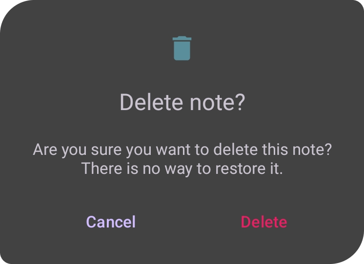

# Notato

This app helps you to save your thoughts using **Room**. The goal of Notato is to
showcase inserting data loading it from Room DB, implementing **DI**, using **RecyclerView** in a **Fragment** and async programming with *Coroutines* and **StateFlow**.
Also implemented `Custom Dialog` with custom layout

### Also I have a [`Compose Version`](https://github.com/uselesscherry/Compose_Notes) of This app

## Screenshots


### What I used in this project:

- [`Jetpack Navigation`](app/src/main/res/navigation/navigation_graph.xml) with `SaveArgs`
- [`Koin DI`](app/src/main/java/com/cherry/notato/di)
- [`Room`](app/src/main/java/com/cherry/notato/data/local)
- [`RecyclerView`](app/src/main/java/com/cherry/notato/ui/NoteListAdapter.kt)
- `Coroutines` and [`StateFlow`](app/src/main/java/com/cherry/notato/ui/NoteViewModel.kt#:~:text=private%20val%20_notes,%3E%3E%20%3D%20_notes)
- `View Binding`
- [`Custom Dialog`](app/src/main/java/com/cherry/notato/ui/DeleteDialog.kt)
- `Custom Exception Class`

### Getting data from DB and observing it in Fragment:

``` kotlin
    private val _notes = MutableStateFlow<List<Note>>(emptyList())
    val notes: StateFlow<List<Note>> = _notes
    
    //loads data from db
    repository.getNotes().onEach { notes ->
            withContext(Dispatchers.IO) {
                _notes.value = notes
            }
        }.launchIn(viewModelScope)
        
    //observing data in Fragment
     private fun setupNoteListAdapter() {
        lifecycleScope.launchWhenStarted {
            viewModel.notes.collect { notes ->
                noteListAdapter = NoteListAdapter(
                    notes = notes
                )
                binding.noteListRecyclerView.adapter = noteListAdapter
            }
        }
    }
```

### Custom Exception:

``` kotlin
     class EmptyFieldsException(message: String) : Exception(message)
     
    @Throws(EmptyFieldsException::class)
    fun insertNote(
        title: String,
        content: String
    ) {
        when {
            title.isBlank() || content.isBlank() -> {
                throw EmptyFieldsException(message = "empty content or title")
            }
            title.isNotEmpty() && content.isNotEmpty() -> {
                viewModelScope.launch(Dispatchers.IO) {
                    repository.insert( Note(title, content.trim()) )
                }
            }
        }
    }
    
    //Fragment method 
    private fun setViewsUp() {
        binding.saveNoteButton.setOnClickListener {
            try {
                viewModel.insertNote(
                    title = binding.editTextNoteTitle.text.toString(),
                    content = binding.editTextNoteContent.text.toString()
                )
                navigateUp()
            } catch (e: NoteViewModel.EmptyFieldsException) {
                Toast.makeText(context, "You need to enter note's title and content", Toast.LENGTH_SHORT).show()
            }
        }
    }
    
```
### Custom DeleteDialog with custom style(for more rounded corners):



``` kotlin

    class DeleteDialog(
    context: Context,
    private val onDeleteApproved: () -> Unit
) : Dialog(context, R.style.DeleteDialog) {

    private lateinit var binding: DeleteDialogBinding

    override fun onCreate(savedInstanceState: Bundle?) {
        super.onCreate(savedInstanceState)
        binding = DeleteDialogBinding.inflate(layoutInflater)
        setupListeners()
        requestWindowFeature(Window.FEATURE_NO_TITLE)
        setCancelable(true)
        setContentView(binding.root)
    }

    private fun setupListeners() {
        binding.buttonApproveDeletingNote.setOnClickListener {
            onDeleteApproved()
            dismiss()
        }
        binding.buttonCancelDeletion.setOnClickListener {
            dismiss()
        }
    }
}

```
